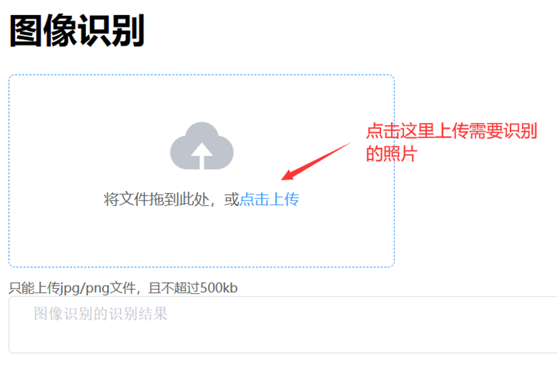
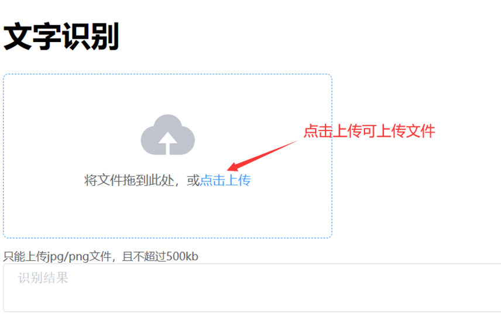
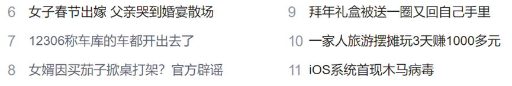
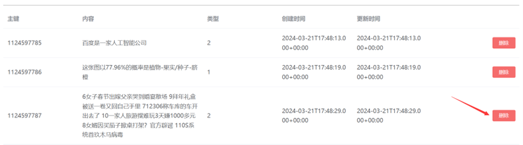
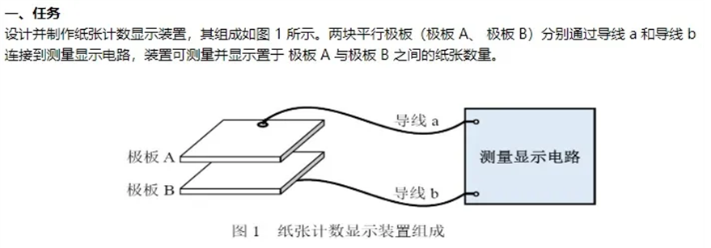

<div style="text-align: center;">

# 郭子新

</div>

## 教育经历

#### 大庆师范学院 本科 电子信息工程

主修课程：c语言程序设计，数据结构，微机原理，嵌入式Linux，数据库系统概论等。

荣誉奖项：二等奖学金

&nbsp;

## 个人自述
对AI有所了解，熟悉常见的机器学习算法，例如线性回归，逻辑回归。

###  

## 项目经历

# 项目1 基于百度AI的文本智能识别系统
[项目代码](https://gitee.com/mndsdrz/fushi20240230/tree/master/%E9%A1%B9%E7%9B%AE1%20%E5%9F%BA%E4%BA%8E%E7%99%BE%E5%BA%A6AI%E7%9A%84%E6%96%87%E6%9C%AC%E6%99%BA%E8%83%BD%E8%AF%86%E5%88%AB%E7%B3%BB%E7%BB%9F)
## 项目背景

在日常生活中，有些照片上的文字，或者某些网页，软件上的文字无法复制，想要获取文字，比较简单的方法就是拍照或者截屏，然后再由人逐个打字，过程麻烦，并且可能由于打字过多中间会出现一些错误，比如错字，语序颠倒。此系统主要基于百度AI的算法能力主要实现文字识别，文字纠错，图片文字提取，图片信息保存功能（其实是这些功能我用得不频繁，开会员感觉有点浪费，调用百度AI的api按量付费，使用这些功能会比较便宜，而且只要能用网页上网的设备都可以用这些功能）。

## 项目主要技术栈

Java，SpringBoot，Vue+Element，MySql，mybatis，百度AI

## 主要功能

集成百度AI能力，实现图片文字识别，图片物品识别，文字纠错，历史使用记录。

<br><br>
## 模块1：NLP纠错

***输入需要纠错的文字***


<br>

***可以获得纠错后正确的句子***


<br><br>
## 模块2：图像识别

***上传照片***



<br>

***这里我选择上传这张照片***


<br>

***图片上传好后就自动识别图片内物品种类***


<br><br>
## 模块3：文字识别

***上传需要识别文字的图片***



<br>

***我上传下面这张图***



<br>

***图片上传好后就自动识别图片内的文字***


<br><br>
## 模块4：历史记录

***由于本项目使用了MySql来记录使用数据，使用上述的三个模块后，获得的三条历史记录***


<br>

***同时，针对历史记录可以任意选择删除某一条记录，我点击箭头所指的这条记录。***



<br>

***点击删除后，mybatis就会将这条历史记录便从数据库中删除，网页上也就不会再显示这条记录了***


## 主要代码

&nbsp;

# 项目2：使用c语言完成一元多项式回归预测纸张数(二次回归)
[项目代码](https://gitee.com/mndsdrz/fushi20240230/tree/master/%E9%A1%B9%E7%9B%AE2%EF%BC%9A%E4%BD%BF%E7%94%A8c%E8%AF%AD%E8%A8%80%E5%AE%8C%E6%88%90%E4%B8%80%E5%85%83%E5%A4%9A%E9%A1%B9%E5%BC%8F%E5%9B%9E%E5%BD%92%E9%A2%84%E6%B5%8B%E7%BA%B8%E5%BC%A0%E6%95%B0(%E4%BA%8C%E6%AC%A1%E5%9B%9E%E5%BD%92))
## 项目背景



在一次比赛中，题目要求如上图，设计一个纸张计数测量显示装置，我们组使用的芯片是stm32，由于此芯片性能不是很高，但对于计算结果实时性要求较高，所以选择使用较为快速的c语言为此装置编程。基本原理就是两极板类似一个"电容"，当两极板放入不同张数的A4纸时，两极板之间距离发生改变，这个电容的电容值会随着距离的增大同时增大。由于这种装置不是很稳定，外界条件影响很大，两极板相同距离之间的电容，在不同温度，不同环境下电容值都会有较大的变化。所以在比赛前就提前就测量好不同纸张数对应的电容值误差会比较大。

## 负责模块

为了让这个装置能够适应不同环境，我负责编写一个函数模块，让这个装置能够"自学习"，在比赛现场，通过两极板依次放入不同张数的A4纸，就能预测更大范围内的纸张张数，无需重新测量电容值，修改代码，烧录程序。，

## 项目内容

函数参数传入一个数组，这个数组内会传进来多个电容值（装置一秒会读取36次电容值，一次读取一秒，大约测量10次），使用c语言完成使用梯度下降法的一元多项式回归 (二次回归，因为电容值跳变不是线性的，而是接近一元二次函数的)，通过此方法训练过后的模型，可以通过10次左右的测量，就可以预测大约一百张左右的A4纸。

## 代码
```c

// 定义了一个数据点结构体 DataPoint，并且使用了一个简单的梯度下降函数gradientDescent来更新参数 a、b 和 c。
// 这个函数会根据数据点和当前参数计算梯度，并更新参数以最小化误差。

#include <stdio.h>
#include <math.h>

//测量次数
#define MEASURE 10

//每次测量的电容值个数
#define Capacitance 36

// 数据点数量
#define N 100

// 学习率
#define LEARNING_RATE 0.01

// 最大迭代次数
#define MAX_ITER 1000

// 数据点结构体
typedef struct {
    double x;//纸张数
    double y;//电容值
} DataPoint;

// 梯度下降算法
void gradientDescent(DataPoint data[MEASURE], double* a, double* b, double* c) {
    double da, db, dc;
    for (int iter = 0; iter < MAX_ITER; iter++) {
        da = db = dc = 0;
        for (int i = 0; i < N; i++) {
            // 计算预测值和实际值之间的差异
            double y_pred = (*a) * data[i].x * data[i].x + (*b) * data[i].x + *c;
            double error = y_pred - data[i].y;

            // 计算梯度
            da += error * data[i].x * data[i].x;
            db += error * data[i].x;
            dc += error;
        }

        // 更新参数
        *a -= LEARNING_RATE * da / N;
        *b -= LEARNING_RATE * db / N;
        *c -= LEARNING_RATE * dc / N;
    }
}

//每次测量MEASURE次，每次Capacitance个电容值
//paper是一个数组，里面记录着与data储存的电容值对应的纸张数
void trainModel(double data[MEASURE][Capacitance], int paper[MEASURE], double* a, double* b, double* c) {
    //为了防止抖动，单次测量的最高和最低10个数去掉，剩下的16个数求平均值作为单次测量的真实值
    int i, j, k;
    int n = Capacitance;
    double temp;
    for (k = 0; k < MEASURE; k++) {
        for (i = 0; i < n; i++) {
            // 最后i个元素已经在正确位置，不需要再比较
            for (j = 0; j < n - i - 1; j++) {
                if (data[k][j] > data[k][j + 1]) {
                    temp = data[k][j];
                    data[k][j] = data[k][j + 1];
                    data[k][j + 1] = temp;
                }
            }
        }
    }

    int index;
    double sum = 0;

    // 初始化数据点
    DataPoint value[MEASURE];

    for (index = 0; index < MEASURE; index++, sum = 0) {
        value[index].x = paper[index];
        for (int indexValue = 10; indexValue < n - 10; indexValue++)
            sum += data[index][indexValue];
        value[index].y = sum / (n-20);
    }
    
    gradientDescent(value, a, b, c);
}

int main() {
    // 参数初始化
    double a = 1, b = 0.1, c = 0.1;

    double dataPf[MEASURE][Capacitance];
    int paper[MEASURE];
    // 训练模型
    trainModel(dataPf,paper, &a, &b, &c);

    // 输出结果
    printf("多项式回归模型: y = %lfx^2 + %lfx + %lf\n", a, b, c);

    return 0;
}
```

&nbsp;

# 项目3：美国金价预测
[项目代码](https://gitee.com/mndsdrz/fushi20240230/tree/master/%E9%A1%B9%E7%9B%AE3%EF%BC%9A%E9%87%91%E4%BB%B7%E9%A2%84%E6%B5%8B%E6%A8%A1%E5%9E%8B)
## 项目背景

在完成项目使用c语言完成一元多项式回归预测纸张后，觉得机器学习是一件奇妙的事情，能够通过某些数学方法预测一些事情，同时使用c语言完成某些机器学习算法比较繁琐，我尝试使用主流的python实现这些算法。偶尔看到金价大涨的消息，我想尝试能否预测金价的价格，于是在网络上寻找到有关贵金属价格的数据集，尝试能否预测金价。

## 项目内容

数据集本身并不是很理想，不同价格对应日期不同。


于是我对数据集清洗后，通过单变量与多变量线性回归，利用pandas进行数据处理，利用numpy进行数据的维度处理，利用sk-learn进行线性回归模型的训练，使得单变量线性回归mse值为73671.35，R方值为0.75，多变量线性回归mse值为1842.97，R方值为0.99。

y 与y'的均方误差(MSE):

.png)

R方值(R2):


## 数据清洗

基本思路就是首先将不同价格分为四个部分，GBPGold.csv，USDGold.csv，USDPlatinum.csv，USDSilver.csv。


使得每个文件都类似上图，只有日期与价格，然后使用pandas，读取四个文件，通过日期为关键词，筛选有相同日期的留下，没有的就删除。

[数据清洗代码](https://gitee.com/mndsdrz/fushi20240230/blob/master/%E9%A1%B9%E7%9B%AE3%EF%BC%9A%E9%87%91%E4%BB%B7%E9%A2%84%E6%B5%8B%E6%A8%A1%E5%9E%8B/%E9%A2%84%E6%B5%8B%E9%87%91%E4%BB%B7%E6%95%B0%E6%8D%AE%E9%9B%86/gold-predict.py)

## 线性回归训练

使用anaconda配置环境，使用Jupyter进行分步骤训练，同时可以显示图像，方便观察数据之间的关系。通过训练，可知通过仅使用线性回归方法，单因子预测金价误差较大，而通过多因子预测准确率会大大提高。

[线性回归训练代码](https://gitee.com/mndsdrz/fushi20240230/blob/master/%E9%A1%B9%E7%9B%AE3%EF%BC%9A%E9%87%91%E4%BB%B7%E9%A2%84%E6%B5%8B%E6%A8%A1%E5%9E%8B/GoldPrice.ipynb)

## 类似项目训练

#### 多分类算法的性别分类

使⽤逻辑回归、K近邻算法、决策树实现身⾼体重性别分类。逻辑回归模型， K近邻算法都预测是男性，而决策树分类器预测为女性，所以在此程序中，决策树分类器并不适合通过身高体重判断性别。

[多分类算法的性别分类](https://gitee.com/mndsdrz/fushi20240230/blob/master/%E9%A1%B9%E7%9B%AE3%EF%BC%9A%E9%87%91%E4%BB%B7%E9%A2%84%E6%B5%8B%E6%A8%A1%E5%9E%8B/%E7%B1%BB%E4%BC%BC%E9%A1%B9%E7%9B%AE%E8%AE%AD%E7%BB%83/%E5%A4%9A%E5%88%86%E7%B1%BB%E7%AE%97%E6%B3%95%E7%9A%84%E6%80%A7%E5%88%AB%E5%88%86%E7%B1%BB.ipynb)

&nbsp;

# 项目4：基于预训练模型的搜索排序系统实现
[项目代码](https://gitee.com/mndsdrz/fushi20240230/tree/master/%E9%A1%B9%E7%9B%AE4%EF%BC%9A%E5%9F%BA%E4%BA%8E%E9%A2%84%E8%AE%AD%E7%BB%83%E6%A8%A1%E5%9E%8B%E7%9A%84%E6%90%9C%E7%B4%A2%E6%8E%92%E5%BA%8F%E7%B3%BB%E7%BB%9F%E5%AE%9E%E7%8E%B0)
## 项目背景

搜索引擎的排序算法对用户体验至关重要。通常，与查询最相关的文档会被排在搜索结果的前列，以增加用户点击的可能性。一个高效的排序算法能够准确评估文档与查询的相关性，并据此排序，以更好地满足用户的搜索需求。

传统的排序方法主要基于文本匹配来检索信息，但由于搜索时通常使用自然语言，这可能导致准确性不足，使得不同的关键词可能指向相同的查询意图，从而增加了不相关文档在搜索结果中的比例。

ERNIE通过大规模数据预训练，能够有效理解语言的深层含义，因此在处理各种自然语言处理问题时表现出色。将ERNIE应用于搜索排序，能够为用户提供更精确、更符合搜索需求的结果，从而提升搜索引擎的整体体验。

## 系统的功能和工作流程

这个搜索引擎利用了百度的ERNIE大模型来构建一个专门针对文献的搜索系统。在这个系统中，用户的查询会经历召回和排序两个阶段，以确保最终展示的文献信息是按照相关性高低进行排序的。

具体工作流程如下：首先，使用召回模型将整个语料库的文献转换为向量形式，并创建一个基于近似最近邻（ANN）的索引库。当用户提出查询时，系统会通过召回模型从语料库中找到50篇与查询最相关的文献。接着，排序模型会对这些召回的文献进行更精确的相似度评估，并按照这个评估结果重新排序，最终将这个排序结果呈现给用户作为搜索输出。

#### 召回模型的结构及每层的作用

召回模型由三个关键部分组成：首先是ERNIE预训练模型，它负责将输入数据转化为语义向量；其次是线性层，它将ERNIE产生的768维向量降维到用户设定的尺寸，这不仅减少了计算负担，也增加了模型的灵活性，使其可以适应不同的应用需求；最后是dropout层，这一层的作用是帮助模型避免过度拟合数据。

#### 排序模型的结构及每层的作用

排序模型中包括三层，第一层是预训练模型ERNIE，用于把输入的数据转换成语义向量；第二层是dropout层，用于在训练过程中随机"丢弃"一部分神经元，防止模型过拟合，提高模型的泛化能力；第三层是相似度计算层，用于将预训练模型生成的向量转换为一个相似度得分，这个层直接关联到最终的排序任务。在模型训练时，通过学习句子对之间的相对相似度，优化模型参数以提高排序的准确性。

## 主要代码文件

**召回模块**[（recall）](https://gitee.com/mndsdrz/fushi20240230/tree/master/%E9%A1%B9%E7%9B%AE4%EF%BC%9A%E5%9F%BA%E4%BA%8E%E9%A2%84%E8%AE%AD%E7%BB%83%E6%A8%A1%E5%9E%8B%E7%9A%84%E6%90%9C%E7%B4%A2%E6%8E%92%E5%BA%8F%E7%B3%BB%E7%BB%9F%E5%AE%9E%E7%8E%B0/recall)

1. [finetune.ipynb](https://gitee.com/mndsdrz/fushi20240230/blob/master/%E9%A1%B9%E7%9B%AE4%EF%BC%9A%E5%9F%BA%E4%BA%8E%E9%A2%84%E8%AE%AD%E7%BB%83%E6%A8%A1%E5%9E%8B%E7%9A%84%E6%90%9C%E7%B4%A2%E6%8E%92%E5%BA%8F%E7%B3%BB%E7%BB%9F%E5%AE%9E%E7%8E%B0/recall/finetune.ipynb) 利用literature\_search\_data数据集进行微调

2. [recall.ipynb](https://gitee.com/mndsdrz/fushi20240230/blob/master/%E9%A1%B9%E7%9B%AE4%EF%BC%9A%E5%9F%BA%E4%BA%8E%E9%A2%84%E8%AE%AD%E7%BB%83%E6%A8%A1%E5%9E%8B%E7%9A%84%E6%90%9C%E7%B4%A2%E6%8E%92%E5%BA%8F%E7%B3%BB%E7%BB%9F%E5%AE%9E%E7%8E%B0/recall/recall.ipynb) 对测试集query进行召回

3. [evaluate.ipynb](https://gitee.com/mndsdrz/fushi20240230/blob/master/%E9%A1%B9%E7%9B%AE4%EF%BC%9A%E5%9F%BA%E4%BA%8E%E9%A2%84%E8%AE%AD%E7%BB%83%E6%A8%A1%E5%9E%8B%E7%9A%84%E6%90%9C%E7%B4%A2%E6%8E%92%E5%BA%8F%E7%B3%BB%E7%BB%9F%E5%AE%9E%E7%8E%B0/recall/evaluate.ipynb) 对召回的数据计算recall@N

在执行evaluate.ipynb的过程中生成的result.tsv 记录recall@1, 5, 10, 20, 50的值

**排序模块**[（rank）](https://gitee.com/mndsdrz/fushi20240230/tree/master/%E9%A1%B9%E7%9B%AE4%EF%BC%9A%E5%9F%BA%E4%BA%8E%E9%A2%84%E8%AE%AD%E7%BB%83%E6%A8%A1%E5%9E%8B%E7%9A%84%E6%90%9C%E7%B4%A2%E6%8E%92%E5%BA%8F%E7%B3%BB%E7%BB%9F%E5%AE%9E%E7%8E%B0/rank)

1. [train\_pairwise](https://gitee.com/mndsdrz/fushi20240230/blob/master/%E9%A1%B9%E7%9B%AE4%EF%BC%9A%E5%9F%BA%E4%BA%8E%E9%A2%84%E8%AE%AD%E7%BB%83%E6%A8%A1%E5%9E%8B%E7%9A%84%E6%90%9C%E7%B4%A2%E6%8E%92%E5%BA%8F%E7%B3%BB%E7%BB%9F%E5%AE%9E%E7%8E%B0/rank/train_pairwise.ipynb): 训练一个排序模型，并在最后进行评估

2. [predict\_pairwise](https://gitee.com/mndsdrz/fushi20240230/blob/master/%E9%A1%B9%E7%9B%AE4%EF%BC%9A%E5%9F%BA%E4%BA%8E%E9%A2%84%E8%AE%AD%E7%BB%83%E6%A8%A1%E5%9E%8B%E7%9A%84%E6%90%9C%E7%B4%A2%E6%8E%92%E5%BA%8F%E7%B3%BB%E7%BB%9F%E5%AE%9E%E7%8E%B0/rank/predict_pairwise.ipynb): 利用训练好的模型，对测试集进行排序

[总程序-两模块合并](https://gitee.com/mndsdrz/fushi20240230/blob/master/%E9%A1%B9%E7%9B%AE4%EF%BC%9A%E5%9F%BA%E4%BA%8E%E9%A2%84%E8%AE%AD%E7%BB%83%E6%A8%A1%E5%9E%8B%E7%9A%84%E6%90%9C%E7%B4%A2%E6%8E%92%E5%BA%8F%E7%B3%BB%E7%BB%9F%E5%AE%9E%E7%8E%B0/search_system/search.ipynb)

## 相关论文研读

[Transformer](https://gitee.com/mndsdrz/fushi20240230/raw/master/%E9%A1%B9%E7%9B%AE4%EF%BC%9A%E5%9F%BA%E4%BA%8E%E9%A2%84%E8%AE%AD%E7%BB%83%E6%A8%A1%E5%9E%8B%E7%9A%84%E6%90%9C%E7%B4%A2%E6%8E%92%E5%BA%8F%E7%B3%BB%E7%BB%9F%E5%AE%9E%E7%8E%B0/Transformer.pdf)